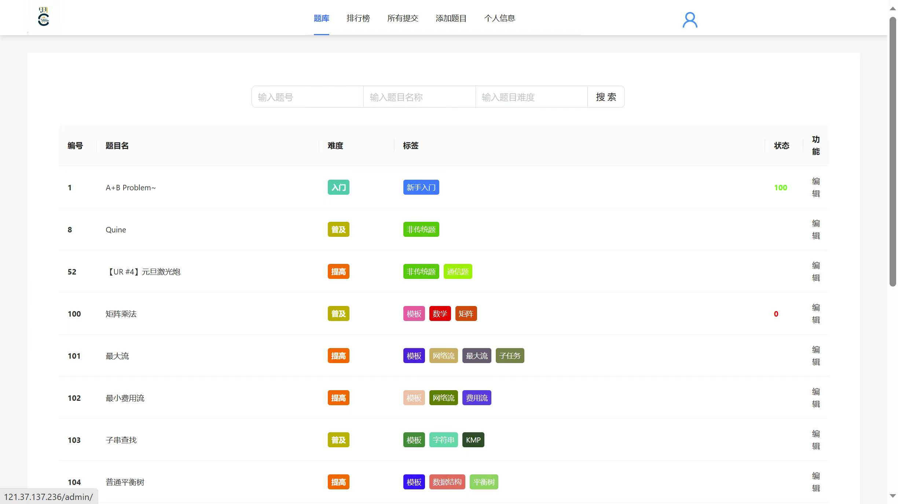
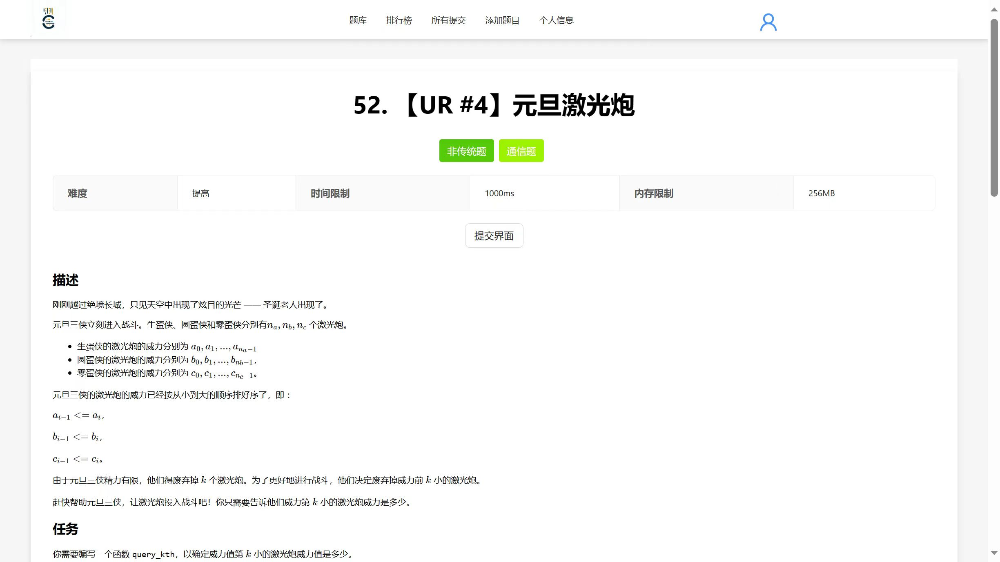
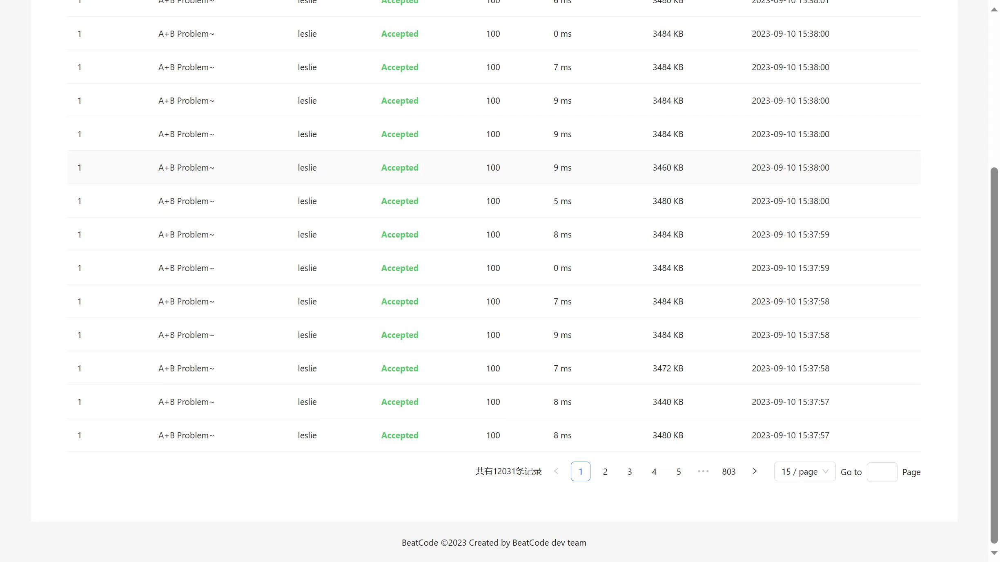
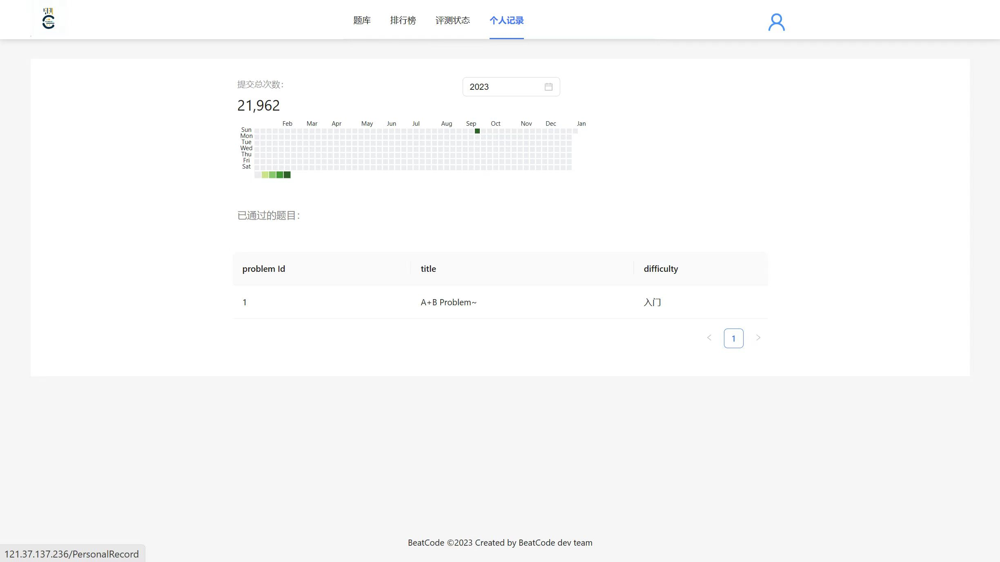

# BeatCode-SE2320-SJTU-2023Summer-frontend
BeatCode oj的前端代码。本项目为上海交通大学软件学院2023年暑期课程《互联网产品设计与开发》课程项目。

链接：

| 仓库名称 | 仓库地址 |
| :---: | :---: |
| 项目仓库 | https://github.com/PeterTheSparrow/BeatCode-SE2320-SJTU-2023Summer |
| 前端 | https://github.com/PeterTheSparrow/BeatCode-SE2320-SJTU-2023Summer-frontend |
| 后端 | https://github.com/PeterTheSparrow/BeatCode-SE2320-SJTU-2023Summer-backend  |

## 目录

- [BeatCode-frontend (React) 前端代码](#beatcode-frontend-react-前端代码)
  - [目录](#目录)
  - [1. 文件结构](#1-文件结构)
  - [2. 效果图展示](#2-效果图展示)
  - [3. 路由守卫设计](#3-路由守卫设计)
  - [4. 其他](#4-其他)


## 1. 文件结构

- src
  - components 组件
  - css 样式
  - img 图片
  - view 页面
  - router 路由
  - service 服务
  - utils 工具

## 2. 效果图展示

首页：



题目详情：



提交列表（恐怖的一万并发！）：



用户个人记录页面：



## 3. 路由守卫设计

路由守卫是前端鉴权非常重要的一部分。在React v5和React v6中，路由守卫的写法有较大的不同。
本项目中采用的是React v6。

参考：
- 官方采用的写法：
https://blog.csdn.net/weixin_68537886/article/details/130688392
- js风格的写法：
```javascript
import React from 'react';
import { BrowserRouter as Router, Routes, Route, Navigate } from 'react-router-dom';

import Home from './components/Home';
import Dashboard from './components/Dashboard';
import Login from './components/Login';

// 自定义路由守卫组件
const PrivateRoute = ({ element: Element, isAuthenticated, ...rest }) => {
  return isAuthenticated ? <Element {...rest} /> : <Navigate to="/login" />;
};

const Routes = ({ isAuthenticated }) => {
  return (
    <Router>
      <Routes>
        <Route path="/" element={<Home />} />
        <Route path="/login" element={<Login />} />
        <Route
          path="/dashboard"
          element={<PrivateRoute element={<Dashboard />} isAuthenticated={isAuthenticated} />}
        />
      </Routes>
    </Router>
  );
};

export default Routes;
```

```javascript
import React, { useState } from 'react';
import Routes from './Routes';

const App = () => {
  const [isAuthenticated, setIsAuthenticated] = useState(false);

  // 在这里根据您的实际逻辑设置 isAuthenticated 状态

  return (
    <div>
      <Routes isAuthenticated={isAuthenticated} />
    </div>
  );
};

export default App;
```
## 4. 其他

由于时间所限，作者没有实现前端的响应式编程（也不会有人在手机上刷oj……吧？不会吧不会吧orz……）
