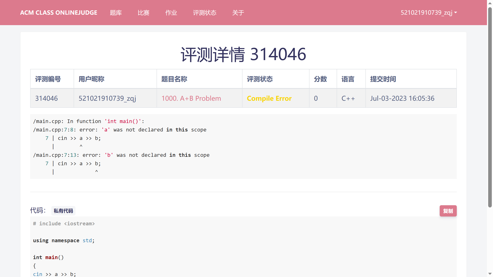
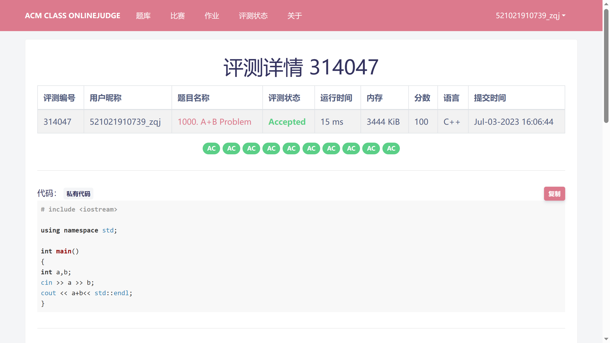
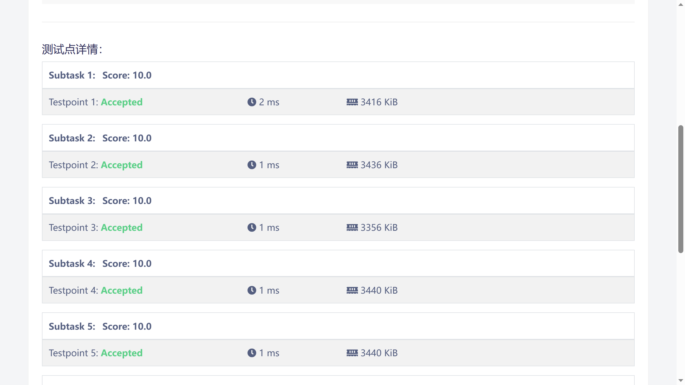

# BeatCode-frontend (React) 前端代码

## 1. 文件结构

```
.
├── src
│   ├── components // 组件
│   ├── view // 页面
│   ├── services // 服务
│   ├── utils // 工具
│   ├── router // 路由
│   ├── img // 图片
│   ├── css // 样式

```

## 2. 代码规范

1. 全部使用函数式组件编写！严禁使用类组件！

## 3. 具体内容介绍

### 3.1 具体题目界面

#### 3.1.1 markdown

参考文章：https://blog.csdn.net/weixin_44589651/article/details/121044772

使用的库：react-markdown。
使用的插件：remark-gfm，用于支持github的markdown语法。

#### 3.1.2 代码编辑框

使用monaco-editor库。
这个东西本质上就是网页版、残疾版的vscode。

关于语法高亮的实现：
https://blog.csdn.net/sd19871122/article/details/121204194

## 4. TODO-List

1. 单击提交以后，跳转到:我的提交，那里显示所有你的提交
   - 评测结果界面！
   - 
   - 
   - 

评测结果界面设计：
1. 标题
2. 表格，点击题目名称或者题目编号，跳转到题目界面
   - 评测状态：AC、WA、TLE、MLE、RE、CE……
   - 运行时间
   - 分数（总共XX/XX，你测试点过了几个）
   - 内存
   - 语言
   - 提交时间
3. 每一个测试点的结果
   - 测试点编号
   - 状态
   - 运行时间
   - 占用内存

## 5. schedule

1. 完成测评结束后的页面：
   2. 单击提交后延迟，显示：提交成功，即将跳转到测评结果页面……


